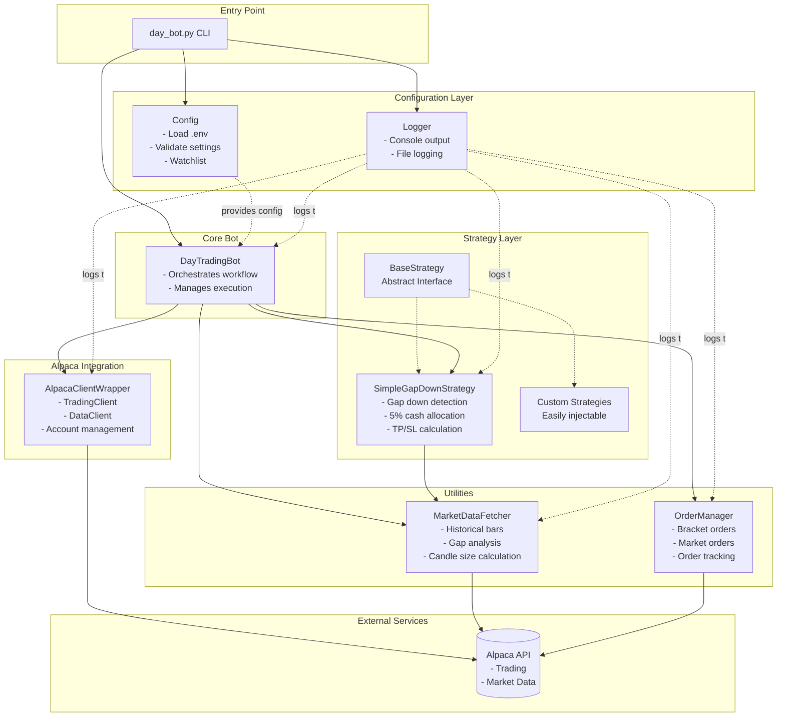
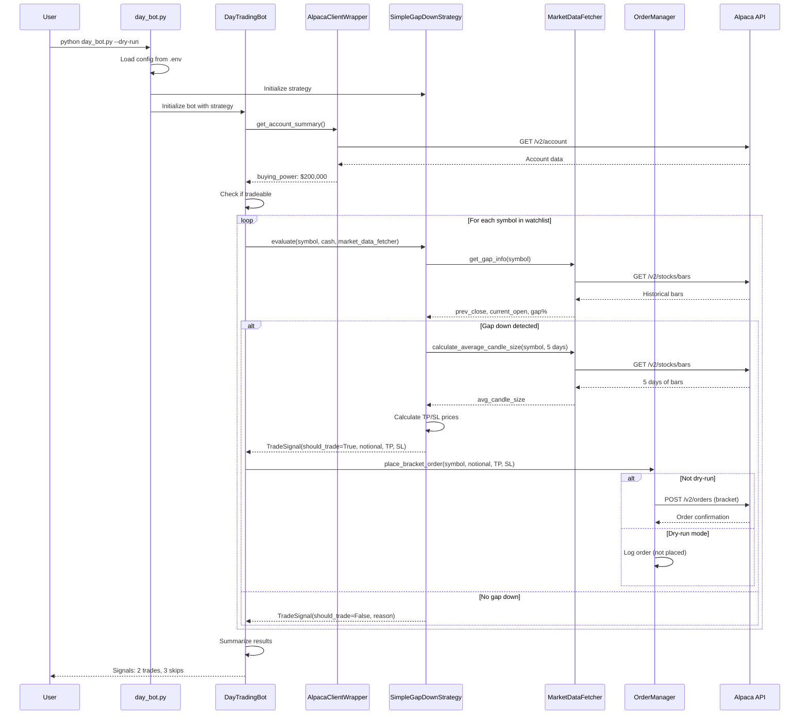
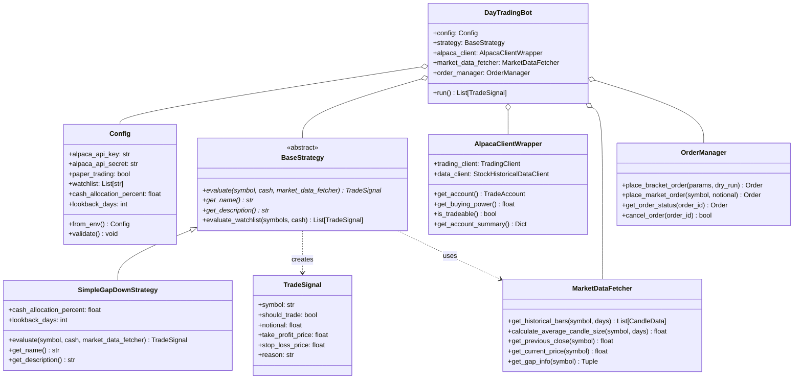
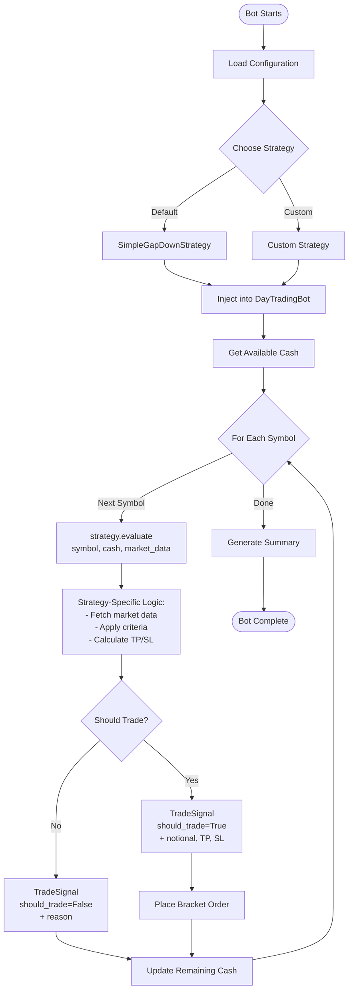
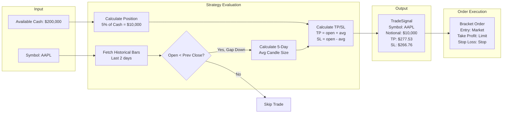
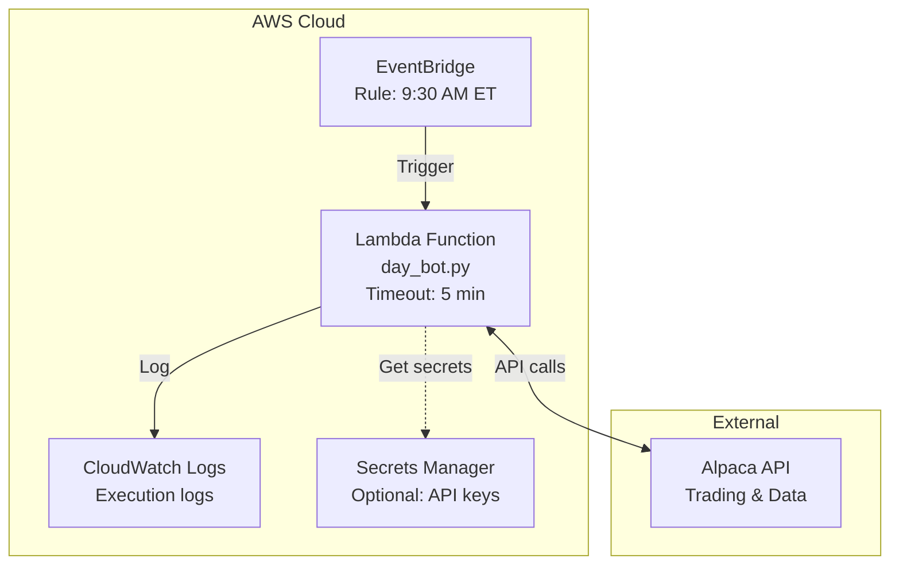

# Trading Bot Architecture

## System Overview



## Workflow Sequence



## Component Details



## Strategy Pattern Flow



## Data Flow: Gap-Down Strategy



## File Structure

```
trading-bot/
│
├── bots/
│   ├── __init__.py
│   └── day_bot.py                    # Main orchestration & CLI
│
├── strategies/
│   ├── __init__.py
│   ├── base_strategy.py              # Abstract strategy interface
│   └── simple_strategy.py            # Gap-down implementation
│
├── utils/
│   ├── __init__.py
│   ├── config.py                     # Configuration management
│   ├── logger.py                     # Logging setup
│   ├── alpaca_client.py              # API client wrapper
│   ├── market_data.py                # Market data utilities
│   └── order_manager.py              # Order placement
│
├── example_custom_strategy.py        # Strategy examples
├── .env                              # API credentials
└── day_bot.log                       # Execution logs
```

## Key Design Patterns

### 1. Strategy Pattern
- **Intent**: Define a family of algorithms, encapsulate each one, and make them interchangeable
- **Implementation**: `BaseStrategy` abstract class, multiple concrete implementations
- **Benefits**: Easy to add new strategies without modifying bot code

### 2. Dependency Injection
- **Intent**: Inject dependencies rather than hard-coding them
- **Implementation**: Bot receives strategy, config, and utilities via constructor
- **Benefits**: Testable, flexible, maintainable

### 3. Facade Pattern
- **Intent**: Provide a simplified interface to complex subsystems
- **Implementation**: `AlpacaClientWrapper` simplifies Alpaca API interaction
- **Benefits**: Easier to use, centralized error handling

### 4. Single Responsibility Principle
- Each class has one reason to change:
  - `Config`: Configuration management only
  - `MarketDataFetcher`: Market data operations only
  - `OrderManager`: Order operations only
  - `Strategy`: Trading logic only
  - `Bot`: Orchestration only

## Deployment Architecture (AWS Lambda)



### Lambda Deployment Steps
1. Package code + dependencies
2. Create Lambda function
3. Set environment variables (API keys)
4. Create EventBridge rule (cron: 9:30 AM ET)
5. Monitor via CloudWatch Logs

### Lambda Handler
```python
def lambda_handler(event, context):
    from bots.day_bot import main
    signals = main(dry_run=False)
    return {
        'statusCode': 200,
        'body': f'{len([s for s in signals if s.should_trade])} trades executed'
    }
```
